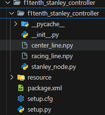

# Racing-line-Project

Racing line jupiter notebook file for generatin racing line based on centerline input, input must be uniform 2.2m wide intented for tracks found here https://github.com/f1tenth/f1tenth_racetracks/tree/main

Stanley controller to be used as a package to be used with a ros2 simulation environment with an Ackermann drive vehicle, place path npy files as this

